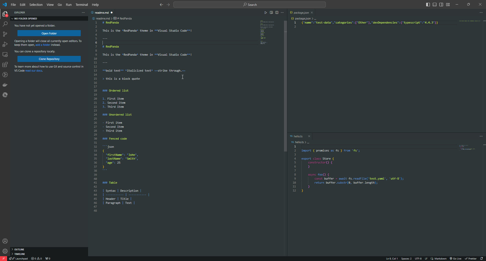
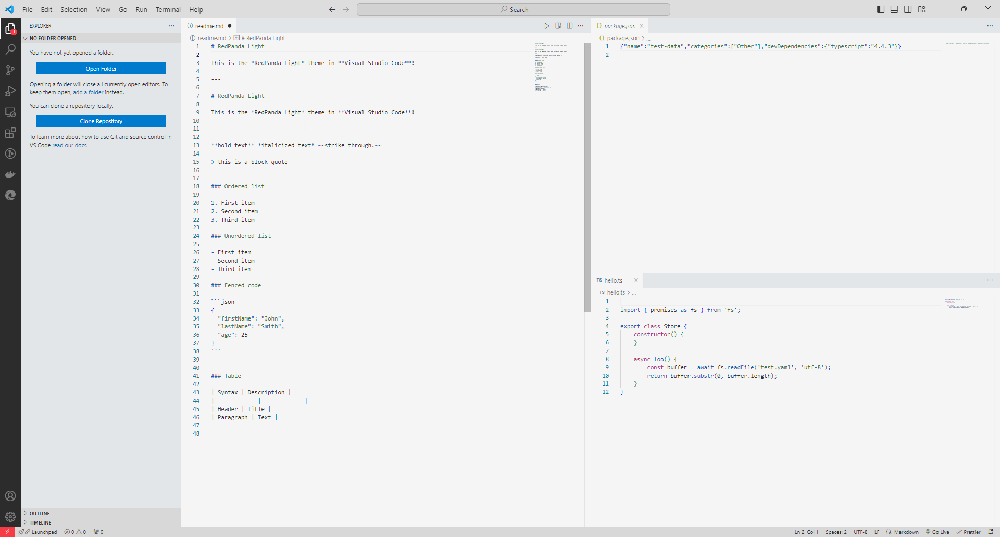
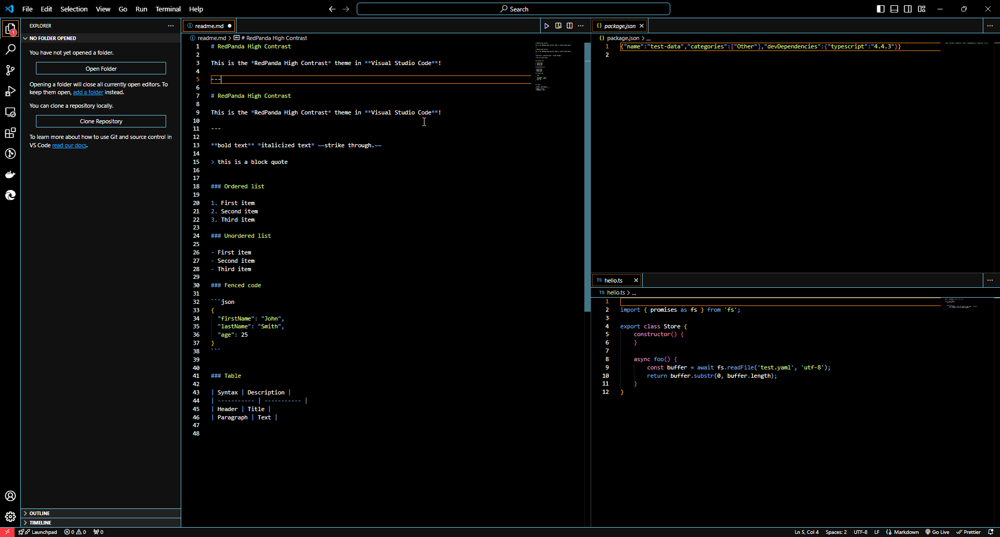

# RedPanda Theme

RedPanda is a vibrant and playful theme inspired by red pandas. It offers a unique color palette that's easy on the eyes while providing good contrast for code readability.



## Features

- Dark, Light, and High Contrast variants
- Carefully selected colors for optimal readability
- Consistent style across multiple editors and tools

## Supported Editors

- Visual Studio Code

## Installation

### Visual Studio Code

1. Go to Extensions view (Ctrl+Shift+X or Cmd+Shift+X)
2. Search for "RedPanda Theme"
3. Click Install
4. Select the theme through File > Preferences > Color Theme > RedPanda (or RedPanda Light / RedPanda High Contrast)

## Theme Preview

### Dark Theme


### Light Theme



### High Contrast Theme



### Recommended Font: Fira Code Nerd Font Mono

For the best experience, we recommend using Fira Code Nerd Font Mono with this theme. Here's how to set it up:

1. Download Fira Code Nerd Font from [the Nerd Fonts website](https://www.nerdfonts.com/font-downloads).
2. Install the font on your system.
3. In VSCode, go to Settings (File > Preferences > Settings).
4. Search for "Font Family" and add `'FiraCode Nerd Font Mono'` to the beginning of the list.
5. Enable font ligatures by searching for "Font Ligatures" in settings and checking the box.

Your font settings should look something like this:

```json
"editor.fontFamily": "'FiraCode Nerd Font Mono', Consolas, 'Courier New', monospace",
"editor.fontLigatures": true
```

## Contributing

We welcome contributions! Please see our [CONTRIBUTING.md](CONTRIBUTING.md) file for details on how to get started.

## License

This project is licensed under the GNU General Public License v3.0 - see the [LICENSE](LICENSE) file for details.

## Disclaimer of Warranty

THERE IS NO WARRANTY FOR THE PROGRAM, TO THE EXTENT PERMITTED BY APPLICABLE LAW. EXCEPT WHEN OTHERWISE STATED IN WRITING THE COPYRIGHT HOLDERS AND/OR OTHER PARTIES PROVIDE THE PROGRAM "AS IS" WITHOUT WARRANTY OF ANY KIND, EITHER EXPRESSED OR IMPLIED, INCLUDING, BUT NOT LIMITED TO, THE IMPLIED WARRANTIES OF MERCHANTABILITY AND FITNESS FOR A PARTICULAR PURPOSE. THE ENTIRE RISK AS TO THE QUALITY AND PERFORMANCE OF THE PROGRAM IS WITH YOU. SHOULD THE PROGRAM PROVE DEFECTIVE, YOU ASSUME THE COST OF ALL NECESSARY SERVICING, REPAIR OR CORRECTION.

## Limitation of Liability

IN NO EVENT UNLESS REQUIRED BY APPLICABLE LAW OR AGREED TO IN WRITING WILL ANY COPYRIGHT HOLDER, OR ANY OTHER PARTY WHO MODIFIES AND/OR CONVEYS THE PROGRAM AS PERMITTED ABOVE, BE LIABLE TO YOU FOR DAMAGES, INCLUDING ANY GENERAL, SPECIAL, INCIDENTAL OR CONSEQUENTIAL DAMAGES ARISING OUT OF THE USE OR INABILITY TO USE THE PROGRAM (INCLUDING BUT NOT LIMITED TO LOSS OF DATA OR DATA BEING RENDERED INACCURATE OR LOSSES SUSTAINED BY YOU OR THIRD PARTIES OR A FAILURE OF THE PROGRAM TO OPERATE WITH ANY OTHER PROGRAMS), EVEN IF SUCH HOLDER OR OTHER PARTY HAS BEEN ADVISED OF THE POSSIBILITY OF SUCH DAMAGES.

## Acknowledgments

- Inspired by the beautiful and playful red pandas
- Color palette carefully crafted for optimal coding experience
- Fira Code Nerd Font Mono for enhanced readability and programming ligatures

## Support

If you encounter any issues or have suggestions, please file an issue on our [GitHub repository](https://github.com/yourusername/redpanda-theme/issues).

Enjoy coding with RedPanda! 🐼
